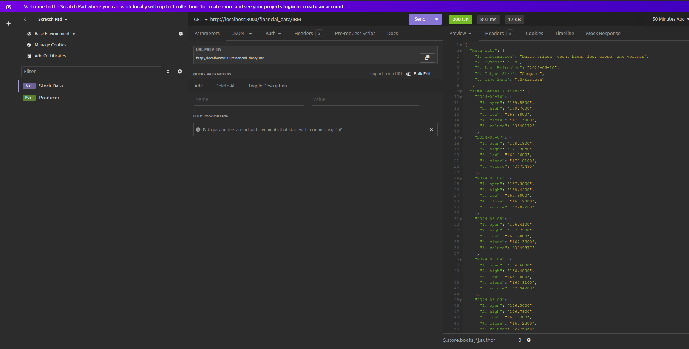

# Project Python-Kafka-Golang

To run this project, you need to have Docker and Docker Compose installed on your machine.

There are five services: Zookeeper, Kafka, Python, Golang, and Kafdrop (a Kafka UI).

Make sure the ports used in the docker-compose.yml file are available on your local machine.

With Docker installed, execute either docker compose up --build or docker-compose up --build, depending on the Docker version and whether you are using Docker Desktop or not.

The Publisher (Python App) retrieves information from a free financial API called Alpha Vantage. You can use Insomnia, Postman, Curl, or similar tools to send a GET request to http://localhost:8000/financial_data/{symbol} to get financial data from the API. The symbol variable should be a stock code, such as MSFT, IBM, or TSLA...

When the API call is made, the Python API streams the message and sends it to the Kafka topic using FastApi's basic background feature. The consumer then retrieves the information from the topic and logs it in JSON format in the terminal.

More information about the financial API can be found here: Alpha Vantage Documentation.

The Kafka-UI application can be accessed at http://localhost:9000. Below is an image of the Kafka-UI, where you can see brokers, topics, partitions, messages, and other details.
 

